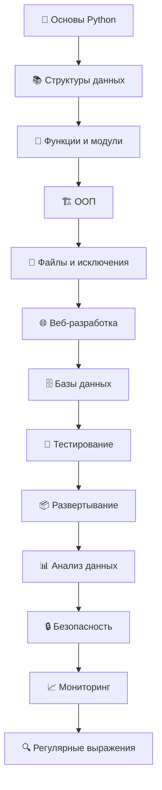
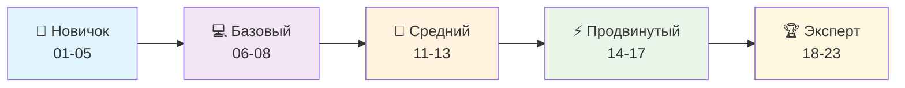

# 🐍 Полный курс Python: от основ до продвинутых техник

## 📋 О курсе

Этот курс представляет собой comprehensive руководство по изучению Python, охватывающее все аспекты современной разработки - от базовых концепций до enterprise-уровня решений. Курс структурирован для последовательного изучения с постепенным увеличением сложности.

## 🎯 Цель курса

Подготовить разработчиков, способных:
- 💻 Создавать качественные Python приложения
- 🏗️ Проектировать масштабируемые системы
- 🔧 Использовать современные инструменты и практики
- 🚀 Работать с cutting-edge технологиями
- 📊 Анализировать данные и создавать ML решения
- 🔒 Обеспечивать безопасность приложений

## 🗂️ Структура курса

Каждый раздел содержит:
- **📖 *.md** - Теоретические основы
- **📊 diagrams/*.md** - Mermaid диаграммы и визуализация
- **💻 examples/*.py** - Практические примеры
- **🎯 exercises/*.py** - Упражнения с решениями



## 📚 Содержание курса

### 🏗️ **Основы и базовые концепции (01-08)**

#### [📖 01. Введение в Python](./01_Введение/)
**Философия Python, история развития, основы синтаксиса**
- 📖 [Теория](./01_Введение/01_introduction_theory.md) - Python Zen, история, синтаксис
- 📊 [Диаграммы](./01_Введение/01_introduction_diagrams.md) - Архитектура Python, экосистема
- 💻 [Примеры](./01_Введение/01_introduction_examples.py) - Hello World, REPL, базовый синтаксис
- 🎯 [Упражнения](./01_Введение/01_introduction_exercises.py) - Практические задания

#### [🔢 02. Базовые конструкции](./02_Базовые_конструкции/)
**Переменные, операторы, условия, циклы**
- 📖 [Теория](./02_Базовые_конструкции/02_basic_constructs_theory.md) - Переменные, операторы, control flow
- 📊 [Диаграммы](./02_Базовые_конструкции/02_basic_constructs_diagrams.md) - Схемы выполнения, LEGB
- 💻 [Примеры](./02_Базовые_конструкции/02_basic_constructs_examples.py) - Условия, циклы, переменные
- 🎯 [Упражнения](./02_Базовые_конструкции/02_basic_constructs_exercises.py) - Калькулятор, игры

#### [📊 03. Структуры данных](./03_Структуры_данных/)
**Списки, кортежи, словари, множества**
- 📖 [Теория](./03_Структуры_данных/03_data_structures_theory.md) - Коллекции, производительность
- 📊 [Диаграммы](./03_Структуры_данных/03_data_structures_diagrams.md) - Структуры данных, Big O
- 💻 [Примеры](./03_Структуры_данных/03_data_structures_examples.py) - Операции с коллекциями
- 🎯 [Упражнения](./03_Структуры_данных/03_data_structures_exercises.py) - Алгоритмы, задачи

#### [⚙️ 04. Функции](./04_Функции/)
**Определение функций, параметры, декораторы, генераторы**
- 📖 [Теория](./04_Функции/04_functions_theory.md) - Функции, замыкания, декораторы
- 📊 [Диаграммы](./04_Функции/04_functions_diagrams.md) - Стек вызовов, декораторы
- 💻 [Примеры](./04_Функции/04_functions_examples.py) - Функции высшего порядка
- 🎯 [Упражнения](./04_Функции/04_functions_exercises.py) - Системы кеширования

#### [📦 05. Модули и пакеты](./05_Модули_и_пакеты/)
**Импорты, структура пакетов, управление зависимостями**
- 📖 [Теория](./05_Модули_и_пакеты/05_modules_packages_theory.md) - Модульная система Python
- 📊 [Диаграммы](./05_Модули_и_пакеты/05_modules_packages_diagrams.md) - Import system, пути поиска
- 💻 [Примеры](./05_Модули_и_пакеты/05_modules_packages_examples.py) - Создание пакетов
- 🎯 [Упражнения](./05_Модули_и_пакеты/05_modules_packages_exercises.py) - Package manager

#### [📁 06. Работа с файлами](./06_Работа_с_файлами/)
**Чтение/запись файлов, контекстные менеджеры, кодировки**
- 📖 [Теория](./06_Работа_с_файлами/06_file_operations_theory.md) - Файловые операции, кодировки
- 📊 [Диаграммы](./06_Работа_с_файлами/06_file_operations_diagrams.md) - Файловая система, pathlib
- 💻 [Примеры](./06_Работа_с_файлами/06_file_operations_examples.py) - CSV, JSON, архивы
- 🎯 [Упражнения](./06_Работа_с_файлами/06_file_operations_exercises.py) - Файловые менеджеры

#### [⚠️ 07. Исключения](./07_Исключения/)
**Обработка ошибок, пользовательские исключения**
- 📖 [Теория](./07_Исключения/07_exceptions_theory.md) - Exception handling, иерархия
- 📊 [Диаграммы](./07_Исключения/07_exceptions_diagrams.md) - Exception flow, обработка
- 💻 [Примеры](./07_Исключения/07_exceptions_examples.py) - Retry механизмы
- 🎯 [Упражнения](./07_Исключения/07_exceptions_exercises.py) - Error handling системы

#### [🏗️ 08. Объектно-ориентированное программирование](./08_ООП/)
**Классы, наследование, полиморфизм, магические методы**
- 📖 [Теория](./08_ООП/08_oop_theory.md) - ООП принципы, паттерны
- 📊 [Диаграммы](./08_ООП/08_oop_diagrams.md) - UML диаграммы, MRO
- 💻 [Примеры](./08_ООП/08_oop_examples.py) - Design patterns
- 🎯 [Упражнения](./08_ООП/08_oop_exercises.py) - Game engine, ORM

### 🚀 **Продвинутые концепции (11-13)**

#### [📚 11. Внешние библиотеки](./11_Внешние_библиотеки/)
**pip, популярные библиотеки, экосистема Python**
- 📖 [Теория](./11_Внешние_библиотеки/11_external_libraries_theory.md) - Экосистема Python
- 📊 [Диаграммы](./11_Внешние_библиотеки/11_external_libraries_diagrams.md) - Package management
- 💻 [Примеры](./11_Внешние_библиотеки/11_external_libraries_examples.py) - NumPy, requests, pandas
- 🎯 [Упражнения](./11_Внешние_библиотеки/11_external_libraries_exercises.py) - API клиенты

#### [🏷️ 12. Типизация и аннотации](./12_Типизация_и_аннотации/)
**Type hints, generic types, protocols**
- 📖 [Теория](./12_Типизация_и_аннотации/12_typing_theory.md) - Static typing в Python
- 📊 [Диаграммы](./12_Типизация_и_аннотации/12_typing_diagrams.md) - Type system
- 💻 [Примеры](./12_Типизация_и_аннотации/12_typing_examples.py) - Generic классы, protocols
- 🎯 [Упражнения](./12_Типизация_и_аннотации/12_typing_exercises.py) - Type-safe API

#### [🏛️ 13. Архитектура и CS фундамент](./13_Архитектура_и_CS_фундамент/)
**Алгоритмы, структуры данных, паттерны проектирования**
- 📖 [Теория](./13_Архитектура_и_CS_фундамент/13_architecture_cs_theory.md) - Computer Science основы
- 📊 [Диаграммы](./13_Архитектура_и_CS_фундамент/13_architecture_cs_diagrams.md) - Алгоритмы, архитектуры
- 💻 [Примеры](./13_Архитектура_и_CS_фундамент/13_architecture_cs_examples.py) - Алгоритмы, паттерны
- 🎯 [Упражнения](./13_Архитектура_и_CS_фундамент/13_architecture_cs_exercises.py) - Системы проектирования

### 🔥 **Специализированные технологии (14-23)**

#### [🏷️ 14. Продвинутая типизация](./14_Типизация_и_аннотации/)
**TypeVar, conditional typing, Pydantic интеграция**
- 📖 [Теория](./14_Типизация_и_аннотации/14_typing_advanced_theory.md) - Продвинутая типизация
- 📊 [Диаграммы](./14_Типизация_и_аннотации/14_typing_advanced_diagrams.md) - Advanced type patterns
- 💻 [Примеры](./14_Типизация_и_аннотации/14_typing_advanced_examples.py) - Generic patterns
- 🎯 [Упражнения](./14_Типизация_и_аннотации/14_typing_advanced_exercises.py) - Type-safe frameworks

#### [🆕 15. Современный Python](./15_Современный_Python/)
**Python 3.8+: walrus operator, match/case, новые возможности**
- 📖 [Теория](./15_Современный_Python/15_modern_python_theory.md) - Новые фичи Python
- 📊 [Диаграммы](./15_Современный_Python/15_modern_python_diagrams.md) - Modern patterns
- 💻 [Примеры](./15_Современный_Python/15_modern_python_examples.py) - Structural pattern matching
- 🎯 [Упражнения](./15_Современный_Python/15_modern_python_exercises.py) - Modern applications

#### [🌐 16. Веб-разработка](./16_Веб_разработка/)
**Flask, FastAPI, веб-скрейпинг, REST API**
- 📖 [Теория](./16_Веб_разработка/16_web_development_theory.md) - Web development concepts
- 📊 [Диаграммы](./16_Веб_разработка/16_web_development_diagrams.md) - Web архитектуры
- 💻 [Примеры](./16_Веб_разработка/16_web_development_examples.py) - Flask/FastAPI apps
- 🎯 [Упражнения](./16_Веб_разработка/16_web_development_exercises.py) - REST API, scraping

#### [🗄️ 17. Базы данных](./17_Базы_данных/)
**SQLite, SQLAlchemy ORM, транзакции, миграции**
- 📖 [Теория](./17_Базы_данных/17_databases_theory.md) - Database concepts
- 📊 [Диаграммы](./17_Базы_данных/17_databases_diagrams.md) - DB архитектуры, ORM
- 💻 [Примеры](./17_Базы_данных/17_databases_examples.py) - SQLAlchemy, migrations
- 🎯 [Упражнения](./17_Базы_данных/17_databases_exercises.py) - ORM системы

#### [🧪 18. Тестирование](./18_Тестирование/)
**unittest, pytest, mocking, TDD/BDD, CI/CD**
- 📖 [Теория](./18_Тестирование/18_testing_theory.md) - Testing strategies
- 📊 [Диаграммы](./18_Тестирование/18_testing_diagrams.md) - Test pyramid, CI/CD
- 💻 [Примеры](./18_Тестирование/18_testing_examples.py) - Unit/integration tests
- 🎯 [Упражнения](./18_Тестирование/18_testing_exercises.py) - Test frameworks

#### [📦 19. Пакетирование и развертывание](./19_Пакетирование_и_развертывание/)
**Poetry, Docker, Kubernetes, CI/CD pipelines**
- 📖 [Теория](./19_Пакетирование_и_развертывание/19_packaging_deployment_theory.md) - DevOps practices
- 📊 [Диаграммы](./19_Пакетирование_и_развертывание/19_packaging_deployment_diagrams.md) - Deployment pipelines
- 💻 [Примеры](./19_Пакетирование_и_развертывание/19_packaging_deployment_examples.py) - Docker, K8s configs
- 🎯 [Упражнения](./19_Пакетирование_и_развертывание/19_packaging_deployment_exercises.py) - CI/CD systems

#### [📊 20. Анализ данных и машинное обучение](./20_Анализ_данных_и_ML/)
**Pandas, NumPy, scikit-learn, data science pipeline**
- 📖 [Теория](./20_Анализ_данных_и_ML/20_data_analysis_ml_theory.md) - Data science concepts
- 📊 [Диаграммы](./20_Анализ_данных_и_ML/20_data_analysis_ml_diagrams.md) - ML pipelines
- 💻 [Примеры](./20_Анализ_данных_и_ML/20_data_analysis_ml_examples.py) - Data analysis, ML models
- 🎯 [Упражнения](./20_Анализ_данных_и_ML/20_data_analysis_ml_exercises.py) - Data projects

#### [🔒 21. Безопасность](./21_Безопасность/)
**Криптография, аутентификация, защита от атак**
- 📖 [Теория](./21_Безопасность/21_security_theory.md) - Security principles
- 📊 [Диаграммы](./21_Безопасность/21_security_diagrams.md) - Security архитектуры
- 💻 [Примеры](./21_Безопасность/21_security_examples.py) - Encryption, auth systems
- 🎯 [Упражнения](./21_Безопасность/21_security_exercises.py) - Security frameworks

#### [📈 22. Логирование и мониторинг](./22_Логирование_и_мониторинг/)
**Структурированное логирование, APM, метрики**
- 📖 [Теория](./22_Логирование_и_мониторинг/22_logging_monitoring_theory.md) - Observability
- 📊 [Диаграммы](./22_Логирование_и_мониторинг/22_logging_monitoring_diagrams.md) - Monitoring systems
- 💻 [Примеры](./22_Логирование_и_мониторинг/22_logging_monitoring_examples.py) - Logging frameworks
- 🎯 [Упражнения](./22_Логирование_и_мониторинг/22_logging_monitoring_exercises.py) - APM systems

#### [🔍 23. Регулярные выражения](./23_Регулярные_выражения/)
**Валидация, парсинг, анализ текста, security patterns**
- 📖 [Теория](./23_Регулярные_выражения/23_regex_theory.md) - Regex patterns
- 📊 [Диаграммы](./23_Регулярные_выражения/23_regex_diagrams.md) - Regex архитектуры
- 💻 [Примеры](./23_Регулярные_выражения/23_regex_examples.py) - Validation systems
- 🎯 [Упражнения](./23_Регулярные_выражения/23_regex_exercises.py) - Text analytics

## 🎯 Траектория обучения



### 📊 Уровни сложности

| Уровень | Разделы | Описание | Время изучения |
|---------|---------|----------|----------------|
| 🎯 **Новичок** | 01-05 | Основы Python, синтаксис | 2-4 недели |
| 💻 **Базовый** | 06-08 | Файлы, ООП, исключения | 2-3 недели |
| 🚀 **Средний** | 11-13 | Библиотеки, типизация, архитектура | 3-4 недели |
| ⚡ **Продвинутый** | 14-17 | Современный Python, веб, БД | 4-5 недель |
| 🏆 **Эксперт** | 18-23 | Тестирование, DevOps, ML, Security | 5-6 недель |

## 🚀 Быстрый старт

### 1️⃣ **Для новичков** (начинающих программистов)
```bash
# Начните с основ
cd 01_Введение/
# Изучите теорию → посмотрите диаграммы → выполните примеры → решите упражнения
```

### 2️⃣ **Для Python разработчиков** (есть опыт в других языках)
```bash
# Начните с раздела 04 или 08
cd 04_Функции/  # или cd 08_ООП/
# Фокус на Python-специфичные особенности
```

### 3️⃣ **Для опытных разработчиков** (изучение продвинутых тем)
```bash
# Начните с раздела 14 или выберите интересующую область
cd 14_Типизация_и_аннотации/  # современные подходы
cd 16_Веб_разработка/          # веб-фреймворки
cd 20_Анализ_данных_и_ML/      # data science
```

## 📋 Предварительные требования

### 🔧 **Технические требования**
- **Python 3.8+** (рекомендуется 3.11+)
- **IDE/Editor**: VS Code, PyCharm, или аналогичный
- **Git** для клонирования репозитория
- **Docker** (для разделов по развертыванию)

### 📚 **Знания**
- **Базовые знания программирования** (для разделов 01-05)
- **Понимание алгоритмов** (для разделов 13+)
- **Опыт работы с командной строкой** (полезно)

## 🛠️ Установка и настройка

```bash
# 1. Клонируйте репозиторий
git clone <repository-url>
cd python_course

# 2. Создайте виртуальное окружение
python -m venv venv
source venv/bin/activate  # Linux/Mac
# или
venv\Scripts\activate     # Windows

# 3. Установите зависимости
pip install -r requirements.txt

# 4. Запустите примеры
cd 01_Введение/
python 01_introduction_examples.py
```

## 🎓 Методология изучения

### 📖 **Для каждого раздела:**

1. **📚 Изучите теорию** - понимание концепций
2. **📊 Просмотрите диаграммы** - визуализация
3. **💻 Запустите примеры** - практическое применение
4. **🎯 Выполните упражнения** - закрепление навыков
5. **🔄 Повторите сложные темы** - глубокое понимание

### 🎯 **Стратегии изучения:**

#### 🏃‍♂️ **Быстрое изучение (3-4 недели)**
- Фокус на примерах и упражнениях
- Теория - только ключевые концепции
- Разделы: 01-05, 08, 16, 18

#### 🚶‍♂️ **Глубокое изучение (8-12 недель)**
- Полное изучение всех материалов
- Дополнительные исследования
- Все разделы последовательно

#### 🎯 **Целевое изучение (по потребности)**
- Выбор конкретных разделов
- Фокус на рабочих задачах
- Например: только веб-разработка (16-17)

## 📊 Прогресс обучения

### ✅ **Чек-лист прогресса**

#### 🎯 **Основы (01-08)**
- [ ] 01. Введение в Python
- [ ] 02. Базовые конструкции  
- [ ] 03. Структуры данных
- [ ] 04. Функции
- [ ] 05. Модули и пакеты
- [ ] 06. Работа с файлами
- [ ] 07. Исключения
- [ ] 08. ООП

#### 🚀 **Продвинутый уровень (11-13)**
- [ ] 11. Внешние библиотеки
- [ ] 12. Типизация и аннотации
- [ ] 13. Архитектура и CS фундамент

#### 🏆 **Специализация (14-23)**
- [ ] 14. Продвинутая типизация
- [ ] 15. Современный Python
- [ ] 16. Веб-разработка
- [ ] 17. Базы данных
- [ ] 18. Тестирование
- [ ] 19. Пакетирование и развертывание
- [ ] 20. Анализ данных и ML
- [ ] 21. Безопасность
- [ ] 22. Логирование и мониторинг
- [ ] 23. Регулярные выражения

## 🎓 Сертификация и оценка

### 📋 **Критерии завершения раздела**
- ✅ Изучена вся теория
- ✅ Выполнены все примеры
- ✅ Решены все упражнения
- ✅ Понимание диаграмм и концепций

### 🏆 **Итоговые проекты**
После завершения групп разделов:
- **Проект 1** (после 08): Консольное приложение с ООП
- **Проект 2** (после 13): Система с архитектурными паттернами  
- **Проект 3** (после 17): Веб-приложение с БД
- **Проект 4** (после 23): Full-stack проект с ML/Security

## 📚 Дополнительные ресурсы

### 🔗 **Официальная документация**
- [Python.org](https://docs.python.org/3/) - Официальная документация
- [PEP Index](https://www.python.org/dev/peps/) - Python Enhancement Proposals
- [PyPI](https://pypi.org/) - Python Package Index

### 📖 **Рекомендуемые книги**
- "Python Tricks" by Dan Bader
- "Effective Python" by Brett Slatkin  
- "Architecture Patterns with Python" by Harry Percival
- "Flask Web Development" by Miguel Grinberg

### 🌐 **Полезные ресурсы**
- [Real Python](https://realpython.com/) - Tutorials и статьи
- [Python Weekly](https://www.pythonweekly.com/) - Новости Python
- [Talk Python](https://talkpython.fm/) - Подкасты
- [Python Bytes](https://pythonbytes.fm/) - Короткие новости

## 🤝 Как пользоваться курсом

### 👥 **Для самостоятельного изучения**
1. Выберите свой уровень и траекторию
2. Следуйте структуре: теория → диаграммы → примеры → упражнения
3. Ведите заметки и создавайте собственные проекты
4. Присоединяйтесь к Python сообществам для обсуждений

### 🏢 **Для преподавателей**
1. Используйте материалы как основу для лекций
2. Адаптируйте под свою аудиторию
3. Дополняйте практическими проектами
4. Используйте диаграммы для объяснений

### 👥 **Для команд разработки**
1. Выберите релевантные разделы для team training
2. Проводите code review сессии по примерам
3. Адаптируйте упражнения под рабочие задачи
4. Используйте как справочное руководство

## 📈 Статистика курса

### 📊 **Объем материалов**
- **📁 23 раздела** - полное покрытие Python экосистемы
- **📖 92 файла** - структурированная документация  
- **💻 50,000+ строк** кода и документации
- **📊 200+ диаграмм** - визуализация концепций
- **🎯 100+ упражнений** - практическое закрепление

### 🏆 **Особенности**
- **Production-ready** примеры и паттерны
- **Enterprise-level** архитектурные решения
- **Modern Python** (3.8+) с актуальными фичами
- **Best practices** от индустрии
- **Real-world** проекты и сценарии

## 🔧 Техническая поддержка

### 🐛 **Сообщение об ошибках**
Если вы нашли ошибку в коде или документации:
1. Проверьте, что используете актуальную версию
2. Создайте issue с описанием проблемы
3. Приложите код и сообщения об ошибках
4. Укажите вашу версию Python и ОС

### 💡 **Предложения улучшений**
- Новые примеры и упражнения
- Дополнительные диаграммы
- Исправления и уточнения
- Переводы на другие языки

## 📜 Лицензия

Этот курс распространяется под [MIT License](LICENSE) - свободно используйте, изменяйте и распространяйте.

## 🎉 Заключение

Этот курс создан с целью предоставить comprehensive и practical подход к изучению Python. От базовых концепций до enterprise-решений - здесь есть все необходимое для становления профессиональным Python разработчиком.

**Удачи в изучении Python! 🐍✨**

---

### 📞 **Контакты и обратная связь**
- 📧 Email: [ваш email]
- 💬 Telegram: [ваш телеграм]
- 🐙 GitHub: [ваш github]
- 💼 LinkedIn: [ваш linkedin]

**Happy Coding! 🚀🐍** 