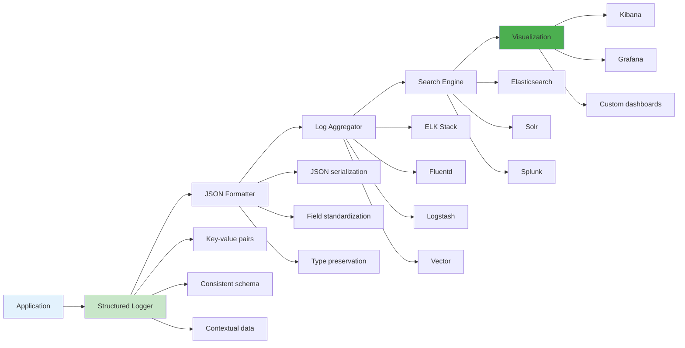
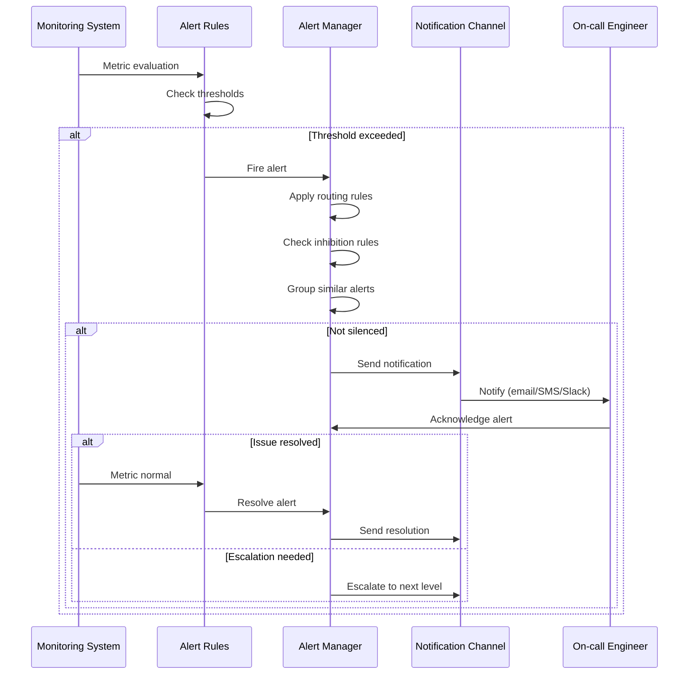
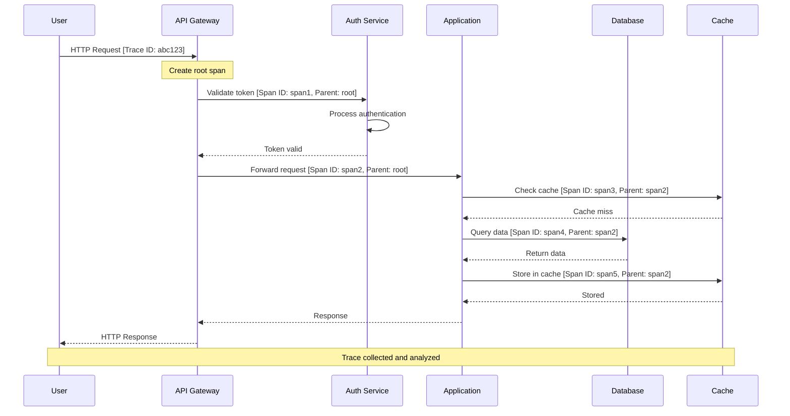
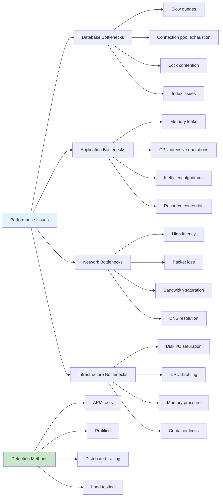
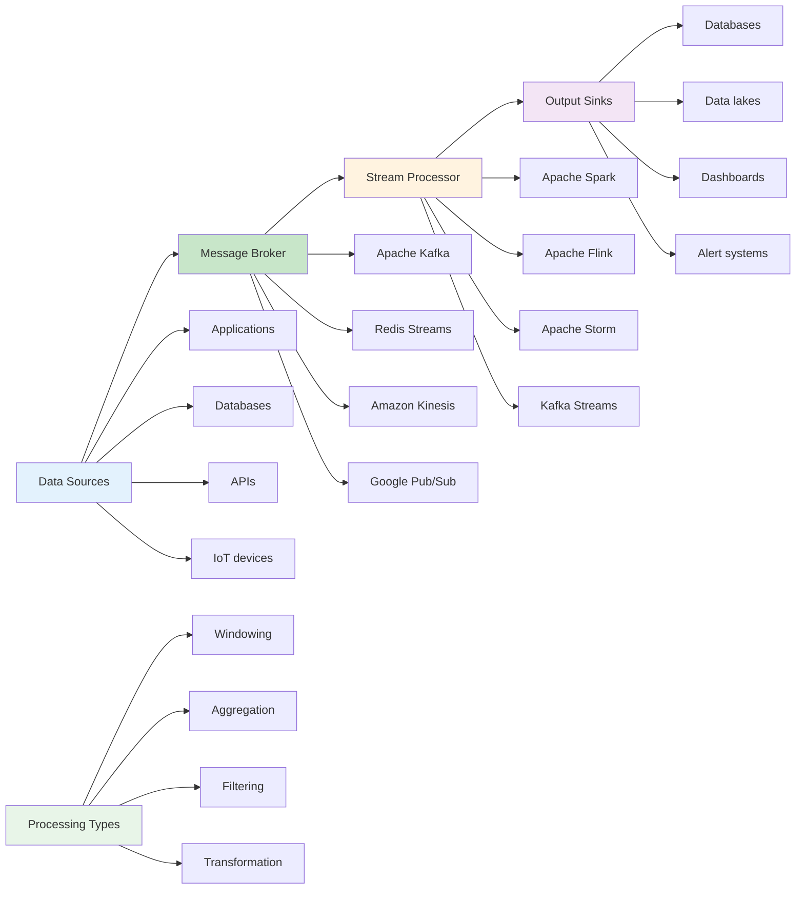

# –î–∏–∞–≥—Ä–∞–º–º—ã: –õ–æ–≥–∏—Ä–æ–≤–∞–Ω–∏–µ –∏ –º–æ–Ω–∏—Ç–æ—Ä–∏–Ω–≥ –≤ Python

## üìù –ê—Ä—Ö–∏—Ç–µ–∫—Ç—É—Ä–∞ –ª–æ–≥–∏—Ä–æ–≤–∞–Ω–∏—è

### Python Logging Framework

```mermaid
graph TD
    A[Python Logging] --> B[Logger]
    A --> C[Handler]
    A --> D[Formatter]
    A --> E[Filter]
    
    B --> B1[Named hierarchies]
    B --> B2[Log level control]
    B --> B3[Message routing]
    B --> B4[Propagation rules]
    
    C --> C1[StreamHandler]
    C --> C2[FileHandler]
    C --> C3[RotatingFileHandler]
    C --> C4[HTTPHandler]
    C --> C5[SMTPHandler]
    C --> C6[SysLogHandler]
    
    D --> D1[Message format]
    D --> D2[Timestamp format]
    D --> D3[Field selection]
    D --> D4[Custom formatting]
    
    E --> E1[Level filtering]
    E --> E2[Content filtering]
    E --> E3[Rate limiting]
    E --> E4[Custom filters]
    
    style A fill:#e3f2fd
    style B fill:#c8e6c9
    style C fill:#fff3e0
    style D fill:#f3e5f5
    style E fill:#e8f5e8
```

### Log Levels –∏ –∏—Ö –∏—Å–ø–æ–ª—å–∑–æ–≤–∞–Ω–∏–µ

```mermaid
graph TD
    A[Log Levels] --> B[CRITICAL - 50]
    A --> C[ERROR - 40]
    A --> D[WARNING - 30]
    A --> E[INFO - 20]
    A --> F[DEBUG - 10]
    A --> G[NOTSET - 0]
    
    B --> B1[üö® System failure]
    B --> B2[üõë Application crash]
    B --> B3[‚ö° Immediate attention]
    
    C --> C1[‚ùå Error occurred]
    C --> C2[üêõ Exception handling]
    C --> C3[üîß Needs investigation]
    
    D --> D1[⚠️ Potential issues]
    D --> D2[üîî Deprecated usage]
    D --> D3[üìã Configuration issues]
    
    E --> E1[ℹ️ General information]
    E --> E2[üìä Business events]
    E --> E3[🎯 User actions]
    
    F --> F1[üîç Detailed debugging]
    F --> F2[🛠️ Development info]
    F --> F3[🔬 Variable states]
    
    G --> G1[👤 Inherit from parent]
    
    H[Production Levels] --> I[INFO and above]
    H --> J[DEBUG disabled]
    
    style B fill:#f44336
    style C fill:#ff9800
    style D fill:#ffeb3b
    style E fill:#4caf50
    style F fill:#2196f3
    style G fill:#9e9e9e
    style H fill:#e3f2fd
```

### Structured Logging Architecture

```mermaid
graph LR
    A[Application] --> B[Structured Logger]
    B --> C[JSON Formatter]
    C --> D[Log Aggregator]
    D --> E[Search Engine]
    E --> F[Visualization]
    
    B --> B1[Key-value pairs]
    B --> B2[Consistent schema]
    B --> B3[Contextual data]
    
    C --> C1[JSON serialization]
    C --> C2[Field standardization]
    C --> C3[Type preservation]
    
    D --> D1[ELK Stack]
    D --> D2[Fluentd]
    D --> D3[Logstash]
    D --> D4[Vector]
    
    E --> E1[Elasticsearch]
    E --> E2[Solr]
    E --> E3[Splunk]
    
    F --> F1[Kibana]
    F --> F2[Grafana]
    F --> F3[Custom dashboards]
    
    style A fill:#e3f2fd
    style B fill:#c8e6c9
    style F fill:#4caf50
```

## üîç –ú–æ–Ω–∏—Ç–æ—Ä–∏–Ω–≥ –ø—Ä–∏–ª–æ–∂–µ–Ω–∏–π

### Observability Stack

```mermaid
graph TD
    A[Observability] --> B[Metrics]
    A --> C[Logs]
    A --> D[Traces]
    A --> E[Events]
    
    B --> B1[System metrics]
    B --> B2[Application metrics]
    B --> B3[Business metrics]
    B --> B4[Custom metrics]
    
    C --> C1[Application logs]
    C --> C2[System logs]
    C --> C3[Security logs]
    C --> C4[Audit logs]
    
    D --> D1[Request traces]
    D --> D2[Distributed tracing]
    D --> D3[Performance traces]
    D --> D4[Error traces]
    
    E --> E1[User events]
    E --> E2[System events]
    E --> E3[Business events]
    E --> E4[Alert events]
    
    F[Three Pillars] --> G[What happened?<br/>Logs]
    F --> H[How much/fast?<br/>Metrics]
    F --> I[Where/why?<br/>Traces]
    
    style A fill:#e3f2fd
    style B fill:#c8e6c9
    style C fill:#fff3e0
    style D fill:#f3e5f5
    style E fill:#e8f5e8
    style F fill:#fce4ec
```

### Application Performance Monitoring

```mermaid
graph TD
    A[APM Architecture] --> B[Data Collection]
    A --> C[Data Processing]
    A --> D[Data Storage]
    A --> E[Data Visualization]
    A --> F[Alerting]
    
    B --> B1[Code instrumentation]
    B --> B2[Auto-instrumentation]
    B --> B3[Agent-based collection]
    B --> B4[SDK integration]
    
    C --> C1[Data aggregation]
    C --> C2[Metric calculation]
    C --> C3[Anomaly detection]
    C --> C4[Correlation analysis]
    
    D --> D1[Time-series databases]
    D --> D2[Document stores]
    D --> D3[Relational databases]
    D --> D4[In-memory caches]
    
    E --> E1[Real-time dashboards]
    E --> E2[Historical reports]
    E --> E3[Performance trends]
    E --> E4[Error analysis]
    
    F --> F1[Threshold alerts]
    F --> F2[Anomaly alerts]
    F --> F3[Notification channels]
    F --> F4[Escalation policies]
    
    style A fill:#e3f2fd
    style B fill:#c8e6c9
    style C fill:#fff3e0
    style D fill:#f3e5f5
    style E fill:#e8f5e8
    style F fill:#ffcdd2
```

## üìä Metrics and KPIs

### Application Metrics Hierarchy

```mermaid
graph TD
    A[Application Metrics] --> B[Technical Metrics]
    A --> C[Business Metrics]
    A --> D[User Experience Metrics]
    
    B --> B1[Response Time]
    B --> B2[Throughput]
    B --> B3[Error Rate]
    B --> B4[Resource Utilization]
    
    C --> C1[Conversion Rate]
    C --> C2[Revenue per User]
    C --> C3[Feature Usage]
    C --> C4[Customer Satisfaction]
    
    D --> D1[Page Load Time]
    D --> D2[Time to First Byte]
    D --> D3[User Session Duration]
    D --> D4[Bounce Rate]
    
    E[Golden Signals] --> F[Latency]
    E --> G[Traffic]
    E --> H[Errors]
    E --> I[Saturation]
    
    F --> F1[Request duration]
    F --> F2[Database query time]
    F --> F3[API response time]
    
    G --> G1[Requests per second]
    G --> G2[Concurrent users]
    G --> G3[Bandwidth usage]
    
    H --> H1[Error rate]
    H --> H2[Exception count]
    H --> H3[Failed requests]
    
    I --> I1[CPU usage]
    I --> I2[Memory usage]
    I --> I3[Disk I/O]
    
    style A fill:#e3f2fd
    style E fill:#c8e6c9
```

### SLA/SLO/SLI Framework

```mermaid
graph TD
    A[Service Level Management] --> B[SLI - Indicators]
    A --> C[SLO - Objectives]
    A --> D[SLA - Agreements]
    
    B --> B1[Quantitative measures]
    B --> B2[Request latency]
    B --> B3[Error rate]
    B --> B4[Throughput]
    B --> B5[Availability]
    
    C --> C1[Target values]
    C --> C2[99.9% availability]
    C --> C3[< 200ms latency]
    C --> C4[< 1% error rate]
    
    D --> D1[Legal commitments]
    D --> D2[Business consequences]
    D --> D3[Customer expectations]
    D --> D4[Penalty clauses]
    
    E[Error Budget] --> F[100% - SLO]
    E --> G[Acceptable downtime]
    E --> H[Innovation vs Reliability]
    
    I[Monitoring Strategy] --> J[SLI measurement]
    I --> K[SLO tracking]
    I --> L[Alert on SLA risk]
    
    style A fill:#e3f2fd
    style B fill:#c8e6c9
    style C fill:#fff3e0
    style D fill:#f3e5f5
    style E fill:#e8f5e8
    style I fill:#fce4ec
```

## üö® Alerting Systems

### Alert Management Pipeline

```mermaid
sequenceDiagram
    participant Monitor as Monitoring System
    participant Rules as Alert Rules
    participant Manager as Alert Manager
    participant Channel as Notification Channel
    participant Oncall as On-call Engineer
    
    Monitor->>Rules: Metric evaluation
    Rules->>Rules: Check thresholds
    
    alt Threshold exceeded
        Rules->>Manager: Fire alert
        Manager->>Manager: Apply routing rules
        Manager->>Manager: Check inhibition rules
        Manager->>Manager: Group similar alerts
        
        alt Not silenced
            Manager->>Channel: Send notification
            Channel->>Oncall: Notify (email/SMS/Slack)
            Oncall->>Manager: Acknowledge alert
            
            alt Issue resolved
                Monitor->>Rules: Metric normal
                Rules->>Manager: Resolve alert
                Manager->>Channel: Send resolution
            else Escalation needed
                Manager->>Channel: Escalate to next level
            end
        end
    end
```

### Alert Fatigue Prevention

```mermaid
graph TD
    A[Alert Fatigue Prevention] --> B[Smart Alerting]
    A --> C[Alert Grouping]
    A --> D[Severity Levels]
    A --> E[Context Enrichment]
    
    B --> B1[Dynamic thresholds]
    B --> B2[Anomaly detection]
    B --> B3[Machine learning]
    B --> B4[Predictive alerting]
    
    C --> C1[Time-based grouping]
    C --> C2[Correlation rules]
    C --> C3[Root cause grouping]
    C --> C4[Service-based grouping]
    
    D --> D1[P1: Critical/Immediate]
    D --> D2[P2: High/1 hour]
    D --> D3[P3: Medium/4 hours]
    D --> D4[P4: Low/Next day]
    
    E --> E1[Runbook links]
    E --> E2[Dashboard links]
    E --> E3[Recent changes]
    E --> E4[Related metrics]
    
    F[Best Practices] --> G[Actionable alerts only]
    F --> H[Clear escalation path]
    F --> I[Regular alert review]
    F --> J[Feedback loops]
    
    style A fill:#e3f2fd
    style B fill:#c8e6c9
    style F fill:#fff3e0
```

## 🕵️ Distributed Tracing

### Distributed Tracing Architecture

```mermaid
graph TD
    A[Distributed Tracing] --> B[Trace Collection]
    A --> C[Span Processing]
    A --> D[Trace Storage]
    A --> E[Trace Analysis]
    
    B --> B1[OpenTelemetry]
    B --> B2[Jaeger Agent]
    B --> B3[Zipkin]
    B --> B4[Custom instrumentation]
    
    C --> C1[Span validation]
    C --> C2[Span enrichment]
    C --> C3[Sampling decisions]
    C --> C4[Span correlation]
    
    D --> D1[Cassandra]
    D --> D2[Elasticsearch]
    D --> D3[ClickHouse]
    D --> D4[BigQuery]
    
    E --> E1[Trace visualization]
    E --> E2[Performance analysis]
    E --> E3[Error correlation]
    E --> E4[Dependency mapping]
    
    F[Trace Components] --> G[Trace ID]
    F --> H[Span ID]
    F --> I[Parent Span ID]
    F --> J[Operation Name]
    F --> K[Start/End Time]
    F --> L[Tags/Logs]
    
    style A fill:#e3f2fd
    style B fill:#c8e6c9
    style C fill:#fff3e0
    style D fill:#f3e5f5
    style E fill:#e8f5e8
    style F fill:#fce4ec
```

### Request Flow Tracing

```mermaid
sequenceDiagram
    participant User as User
    participant Gateway as API Gateway
    participant Auth as Auth Service
    participant App as Application
    participant DB as Database
    participant Cache as Cache
    
    User->>Gateway: HTTP Request [Trace ID: abc123]
    Note over Gateway: Create root span
    
    Gateway->>Auth: Validate token [Span ID: span1, Parent: root]
    Auth->>Auth: Process authentication
    Auth-->>Gateway: Token valid
    
    Gateway->>App: Forward request [Span ID: span2, Parent: root]
    
    App->>Cache: Check cache [Span ID: span3, Parent: span2]
    Cache-->>App: Cache miss
    
    App->>DB: Query data [Span ID: span4, Parent: span2]
    DB-->>App: Return data
    
    App->>Cache: Store in cache [Span ID: span5, Parent: span2]
    Cache-->>App: Stored
    
    App-->>Gateway: Response
    Gateway-->>User: HTTP Response
    
    Note over User,Cache: Trace collected and analyzed
```

## üìà Performance Monitoring

### Performance Metrics Dashboard

```mermaid
graph TD
    A[Performance Dashboard] --> B[Response Time Metrics]
    A --> C[Throughput Metrics]
    A --> D[Resource Utilization]
    A --> E[Error Metrics]
    A --> F[User Experience]
    
    B --> B1[Average response time]
    B --> B2[95th percentile]
    B --> B3[99th percentile]
    B --> B4[Max response time]
    
    C --> C1[Requests per second]
    C --> C2[Transactions per minute]
    C --> C3[Concurrent users]
    C --> C4[Data transfer rate]
    
    D --> D1[CPU utilization]
    D --> D2[Memory usage]
    D --> D3[Disk I/O]
    D --> D4[Network I/O]
    
    E --> E1[Error rate]
    E --> E2[Exception count]
    E --> E3[HTTP error codes]
    E --> E4[Database errors]
    
    F --> F1[Apdex score]
    F --> F2[User satisfaction]
    F --> F3[Conversion rate]
    F --> F4[Bounce rate]
    
    style A fill:#e3f2fd
    style B fill:#c8e6c9
    style C fill:#fff3e0
    style D fill:#f3e5f5
    style E fill:#ffcdd2
    style F fill:#e8f5e8
```

### Performance Bottleneck Detection

```mermaid
graph LR
    A[Performance Issues] --> B[Database Bottlenecks]
    A --> C[Application Bottlenecks]
    A --> D[Network Bottlenecks]
    A --> E[Infrastructure Bottlenecks]
    
    B --> B1[Slow queries]
    B --> B2[Connection pool exhaustion]
    B --> B3[Lock contention]
    B --> B4[Index issues]
    
    C --> C1[Memory leaks]
    C --> C2[CPU-intensive operations]
    C --> C3[Inefficient algorithms]
    C --> C4[Resource contention]
    
    D --> D1[High latency]
    D --> D2[Packet loss]
    D --> D3[Bandwidth saturation]
    D --> D4[DNS resolution]
    
    E --> E1[Disk I/O saturation]
    E --> E2[CPU throttling]
    E --> E3[Memory pressure]
    E --> E4[Container limits]
    
    F[Detection Methods] --> G[APM tools]
    F --> H[Profiling]
    F --> I[Distributed tracing]
    F --> J[Load testing]
    
    style A fill:#e3f2fd
    style F fill:#c8e6c9
```

## 🔄 Real-time Monitoring

### Event-Driven Monitoring

```mermaid
graph TD
    A[Event-Driven Monitoring] --> B[Event Sources]
    A --> C[Event Processing]
    A --> D[Event Storage]
    A --> E[Event Analysis]
    A --> F[Actions]
    
    B --> B1[Application events]
    B --> B2[System events]
    B --> B3[User events]
    B --> B4[Business events]
    
    C --> C1[Event filtering]
    C --> C2[Event enrichment]
    C --> C3[Event correlation]
    C --> C4[Event aggregation]
    
    D --> D1[Event streams]
    D --> D2[Event store]
    D --> D3[Time-series DB]
    D --> D4[Search index]
    
    E --> E1[Pattern detection]
    E --> E2[Anomaly detection]
    E --> E3[Trend analysis]
    E --> E4[Root cause analysis]
    
    F --> F1[Alert generation]
    F --> F2[Auto-remediation]
    F --> F3[Notification]
    F --> F4[Escalation]
    
    style A fill:#e3f2fd
    style B fill:#c8e6c9
    style C fill:#fff3e0
    style D fill:#f3e5f5
    style E fill:#e8f5e8
    style F fill:#fce4ec
```

### Stream Processing Architecture

```mermaid
graph LR
    A[Data Sources] --> B[Message Broker]
    B --> C[Stream Processor]
    C --> D[Output Sinks]
    
    A --> A1[Applications]
    A --> A2[Databases]
    A --> A3[APIs]
    A --> A4[IoT devices]
    
    B --> B1[Apache Kafka]
    B --> B2[Redis Streams]
    B --> B3[Amazon Kinesis]
    B --> B4[Google Pub/Sub]
    
    C --> C1[Apache Spark]
    C --> C2[Apache Flink]
    C --> C3[Apache Storm]
    C --> C4[Kafka Streams]
    
    D --> D1[Databases]
    D --> D2[Data lakes]
    D --> D3[Dashboards]
    D --> D4[Alert systems]
    
    E[Processing Types] --> F[Windowing]
    E --> G[Aggregation]
    E --> H[Filtering]
    E --> I[Transformation]
    
    style A fill:#e3f2fd
    style B fill:#c8e6c9
    style C fill:#fff3e0
    style D fill:#f3e5f5
    style E fill:#e8f5e8
```

## 🎯 Custom Monitoring Solutions

### Python Monitoring Stack

```mermaid
graph TD
    A[Python Monitoring] --> B[Logging Libraries]
    A --> C[Metrics Libraries]
    A --> D[Tracing Libraries]
    A --> E[Monitoring Frameworks]
    
    B --> B1[structlog]
    B --> B2[loguru]
    B --> B3[python-json-logger]
    B --> B4["logging (stdlib)"]
    
    C --> C1[prometheus_client]
    C --> C2[statsd]
    C --> C3[py-metrics]
    C --> C4[custom metrics]
    
    D --> D1[opentelemetry]
    D --> D2[jaeger-client]
    D --> D3[zipkin-py]
    D --> D4[py-zipkin]
    
    E --> E1[Sentry]
    E --> E2[New Relic]
    E --> E3[Datadog]
    E --> E4[Elastic APM]
    
    F[Integration Patterns] --> G[Decorator-based]
    F --> H[Context managers]
    F --> I[Middleware]
    F --> J[Aspect-oriented]
    
    style A fill:#e3f2fd
    style B fill:#c8e6c9
    style C fill:#fff3e0
    style D fill:#f3e5f5
    style E fill:#e8f5e8
    style F fill:#fce4ec
```

### Health Check Architecture

```mermaid
graph TD
    A[Health Checks] --> B[Shallow Checks]
    A --> C[Deep Checks]
    A --> D[Dependency Checks]
    A --> E[Business Logic Checks]
    
    B --> B1[Process running]
    B --> B2[Port listening]
    B --> B3[HTTP endpoint]
    B --> B4[Memory usage]
    
    C --> C1[Database connectivity]
    C --> C2[Cache availability]
    C --> C3[External API status]
    C --> C4[File system access]
    
    D --> D1[Upstream services]
    D --> D2[Database health]
    D --> D3[Message queue status]
    D --> D4[Third-party APIs]
    
    E --> E1[Business rules validation]
    E --> E2[Data consistency checks]
    E --> E3[Performance benchmarks]
    E --> E4[Feature toggles status]
    
    F[Health Check Types] --> G[Liveness probes]
    F --> H[Readiness probes]
    F --> I[Startup probes]
    
    G --> G1[Is the app running?]
    H --> H1[Can it serve traffic?]
    I --> I1[Has it started up?]
    
    style A fill:#e3f2fd
    style B fill:#c8e6c9
    style C fill:#fff3e0
    style D fill:#f3e5f5
    style E fill:#e8f5e8
    style F fill:#fce4ec
```

–≠—Ç–∏ –¥–∏–∞–≥—Ä–∞–º–º—ã –ø–æ–∫–∞–∑—ã–≤–∞—é—Ç –∫–æ–º–ø–ª–µ–∫—Å–Ω—ã–π –ø–æ–¥—Ö–æ–¥ –∫ –ª–æ–≥–∏—Ä–æ–≤–∞–Ω–∏—é –∏ –º–æ–Ω–∏—Ç–æ—Ä–∏–Ω–≥—É Python –ø—Ä–∏–ª–æ–∂–µ–Ω–∏–π –æ—Ç –±–∞–∑–æ–≤–æ–≥–æ –ª–æ–≥–∏—Ä–æ–≤–∞–Ω–∏—è –¥–æ —Å–ª–æ–∂–Ω—ã—Ö —Å–∏—Å—Ç–µ–º observability. 